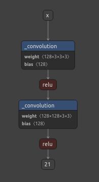

# RepNets
Structural Reparameterization of convolutional layers is a very useful trick first introduced in **RepVGG: Making VGG-style ConvNets Great Again** ([arxiv](https://arxiv.org/abs/2101.03697)) and later used in **MobileOne: An Improved One millisecond Mobile Backbone** ([arxiv](https://arxiv.org/abs/2206.04040)) among others. The basic idea is as follows:  
1. Train an ***overparameterized, branching*** network. This network is larger and more complicated than necessary to better facilitate gradient flow. Here's an example of a *very* simple, toy archirecture with two stages (the first stage has `in_channels != out_channels`, and the second stage has `in_channels == out_channels`, which is the segment with the third batchnorm operation):  
<p align="center">
  
</p>
2. Once training is finished, create the deployable inference model by folding segments of branches of convolutional layers into single-layer segments to produce a ***reparameterized, non-branching*** network that is significantly faster and comes with a much lower memory access cost (MAC) than the network used during training. Here is the same network, reparameterized:  
<p align="center">
  
</p>


This type of thing is critical for edge deployments where MAC and such come at a premium. For more reading on efficient model design I recommend **ShuffleNet V2: Practical Guidelines for Efficient CNN Architecture Design** ([arxiv](https://arxiv.org/abs/1807.11164)). The earlier papers mentioned borrow a lot of concepts from this one.

# Getting Started
`example.py` contains everything you need to get started. **NOTE: In this script we're using the toy model, which is intentially tiny and easy to understand. The accuracy will be pretty bad, but this is to demonstrate first to train/reparameterize and second the difference in speed/accuracy between the training/inference models**. That in mind, here are the numbers after 10 epochs (only 10 because my personal GPU is precious).

```
Final Original Accuracy: 0.497, Mean Inference Time: 0.00057
Final Reparameterized Accuracy: 0.497, Mean Inference Time: 0.000279
```

That's a 50% speed-up at no cost. Nice.


